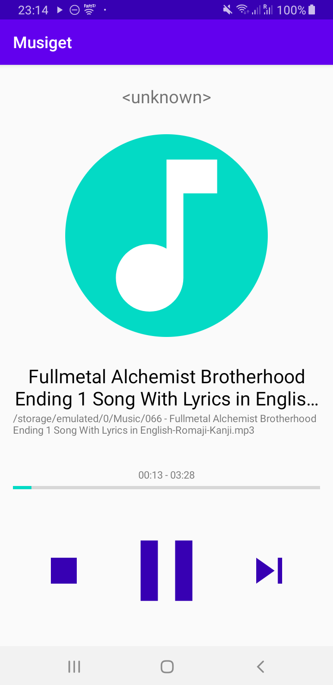
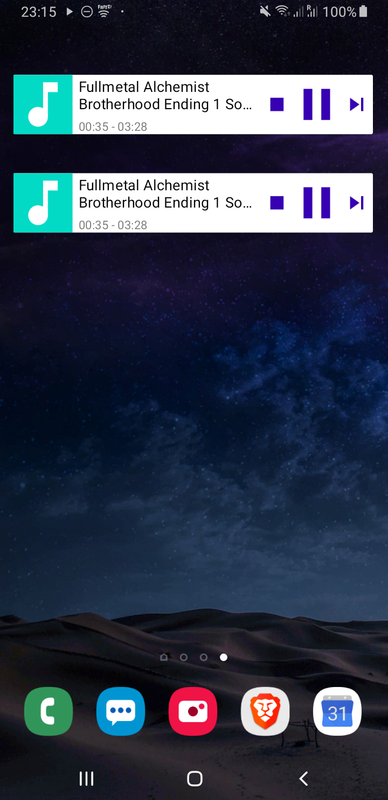

# Musiget App

## Requirements
- Source code need to be in Java.
- App which provides a widget to play random music
- Possibility to stop music and start buttons
- Running in the background
- Displaying meta data

## Project Setup
* MVVM Clean architecture
* Dagger (Component, SubComponent with scoping)
* Multi modules
* Unit Tests
* buildSrc
* RxJava
* Repositories
* Core Service

## To Add
* Travis for building and Testing
* More unit testing
* Replacing service core implementation by by `MediaBrowserServiceCompat`

## Demo
* Debug: Test [me](demo/app-debug.apk)

**Main Screen**

**Widget**

